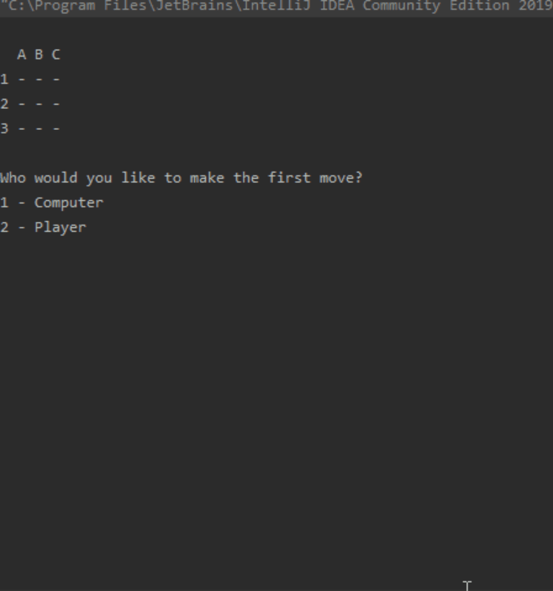

###What is the project about?

This program can be used for playing Tic-Tac-Toe in the command line by a single player against the machine. 
The logic of producing machine-moves is based on a decision tree. The tree is searched by the MiniMax algorithm which has been expedited by the Alpha-Beta Pruning algorithm.

###How to run the code?

You could "checkout" the project with your preferred IDEA or alternatively:

 1. Download this project onto your PC
 2. Install java JDK onto your PC from here: https://docs.oracle.com/javase/10/install/toc.htm
 3. Open a command prompt window and go to the directory where you saved the java program.
 4. Compile the code using the javac command plus java file name such as: "javac App.java". 
 5. Once the project has been compiled, type "java App" to run the program. The game will begin in your command line.
 6. Have fun :)

###The program in action

###Areas for possible development:
There is plenty of room for improvement. A few of the ideas I have in mind:
*Expanding the size of the board to 20x20 instead of 3x3. Adjusting the rules of the game according to the expansion as needed. (eg. 5 of the same type of signs need to be lined up to win)
*Expanding the test coverage to 100%.
*Creating a graphical user interface to the program.
*Implementing other search algorithms.

If you would like to contribute to this project you are very welcome to do so. Please open an issue so that we can discuss your idea.